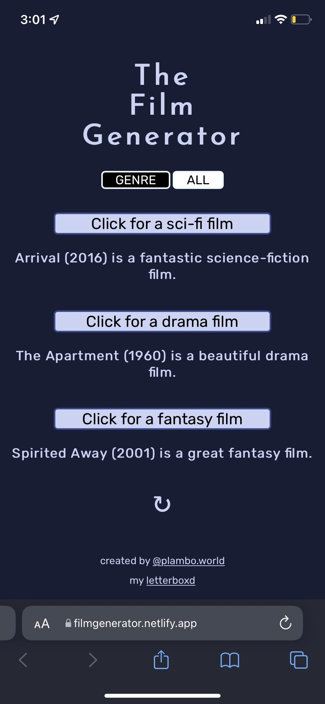
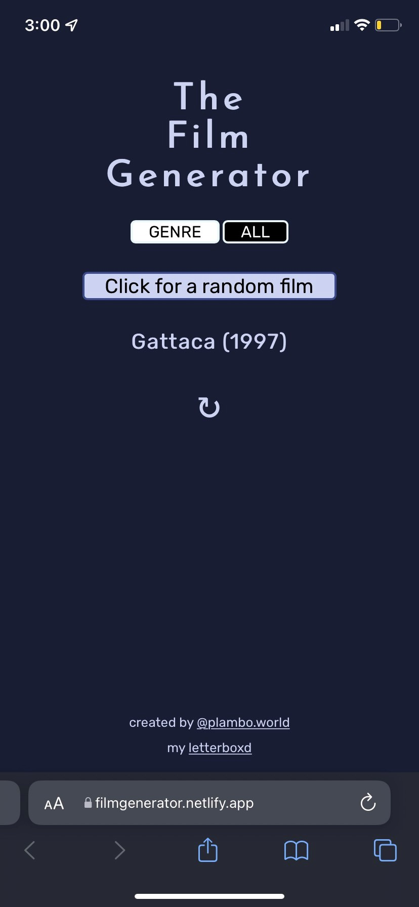
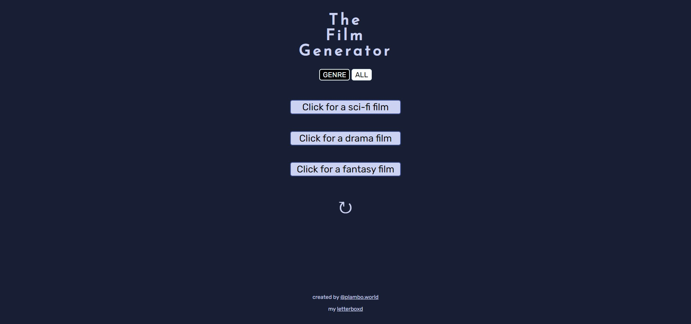

# [Film Generator](https://filmgenerator.netlify.app/)
## Based on Codecademy's "Mixed Messages" JavaScript Project

### Overview:
- A responsive web app that helps decide what film you should watch
- One setting randomly generates films from three different genres and creates a sentence with a randomized adjective included.
- The other setting randomly generates one film, regardless of genre.
- User has the ability to switch between these two generator settings.
- User has the ability to reset the films and sentences generated.
- [See it in action](https://filmgenerator.netlify.app/)

### Built With:
1. JavaScript
2. CSS
3. HTML

### Photos:

### Contact:

- [Portfolio Website](https://plambo.world)
- [Email](mailto:austinplambeck@gmail.com)
- [LinkedIn](https://www.linkedin.com/in/austinplambeck/)