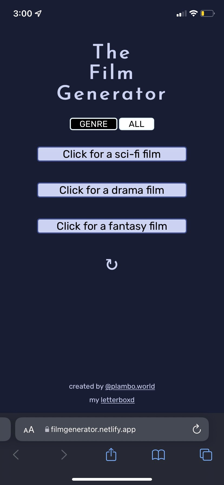

# Film Generator
## Based on Codecademy's "Mixed Messages" JavaScript Project

### Overview:
- A responsive app that helps decide what film to watch
- One setting randomly generates films from three different genres and creates a sentence with a randomized adjective included.
- The other setting randomly generates one film, regardless of genre.
- User has the ability to switch between these two generator settings.
- User has the ability to reset the films and sentences generated.

### Built With:
1. JavaScript
2. HTML
3. CSS

### Photos:

### Contact:

[Portfolio Website](https://plambo.world)
[Email](mailto:austinplambeck@gmail.com)